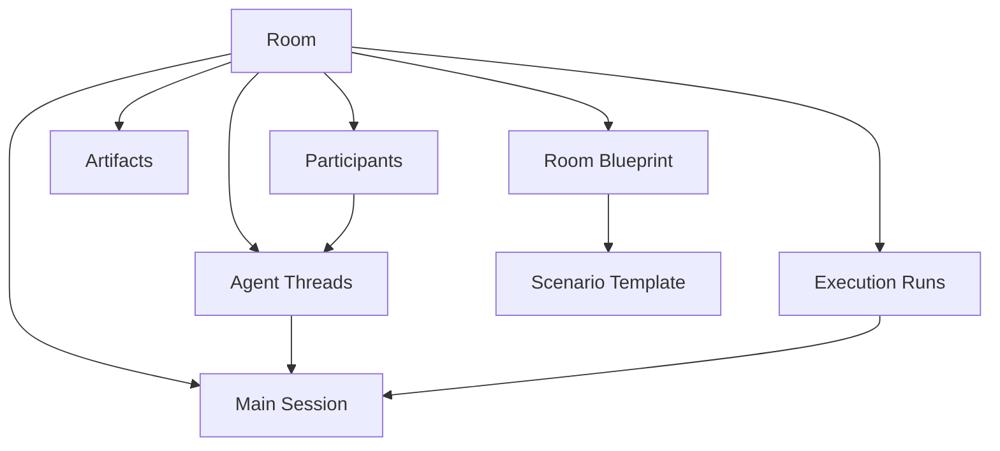

# Room-Centric Core Architecture

## Purpose

This document defines the canonical architecture for AX-001 as a room-centric multi-agent interaction platform.

It is intended to remove ambiguity between:

- `room`
- `session`
- `workflow`
- `agent memory`
- `scenario-specific orchestration`

The goal is to make future implementation and refactoring decisions converge on one stable model.

## Design Statement

AX-001 is built around one primary product object: `room`.

A `room` is a persistent collaborative space where:

- one shared `main session` evolves over time
- multiple agents participate around that shared session
- each agent keeps an independent identity and memory state
- the user can join the room and speak inside the same shared session
- different application modes are realized by room-specific orchestration, not by replacing the core runtime

This means AX-001 should be understood as:

- `Room` as the durable workspace
- `Main Session` as the durable shared conversation line
- `Workflow` as the execution mechanism that advances the room
- `Agent Threads` as per-agent persistent identity and memory carriers
- `Scenario Template / Blueprint` as the specialization layer for different room behaviors

## Core Principles

### 1. Room Is The Primary Product Object

The room is the top-level runtime and persistence boundary.

Everything belongs to a room:

- participants
- messages
- main session state
- agent thread state
- governance roles
- artifacts
- execution records

The product should never be modeled as "agents first" or "workflow first".

It should be modeled as "rooms that host evolving agent collaboration".

### 2. A Room Owns One Shared Main Session

Each room has one continuous `main session`.

The main session is:

- persistent
- append-only in its public dialogue history
- shared by all participants
- the authoritative public context of the room

The main session should not be broken simply because one workflow pass ends, one batch finishes, or one processing loop stops.

Operational runs may come and go, but the main session remains the same ongoing conversation line.

### 3. Agents Collaborate Around The Main Session

Agents do not run as isolated chatbots with fully separate public conversations.

Instead, each agent:

- reads the current main session context
- reads its own identity and memory state
- produces one contribution into the shared room
- updates its own private memory after acting

All public room progress is expressed through messages appended to the main session.

### 4. Agent Identity And Memory Are Persistent

Each agent in a room has durable private state.

This state includes:

- stable identity
- role template
- behavioral instructions
- short-term working memory
- compressed long-term memory
- session-local or room-local private notes

This allows the same room to grow over time without agents becoming stateless between turns.

### 5. Workflow Advances The Room, Not Replaces It

`workflow` is not the same thing as the room or the session.

A workflow is the runtime mechanism that decides how the room advances, for example:

- who should speak next
- whether the room is waiting for user input
- whether a host should moderate
- whether a recorder should emit an artifact
- whether the room should change phase

Different room types may use different workflow policies, but they should still operate on the same room-centric state model.

### 6. Scenario Specialization Happens Above The Core

Different product experiences should not require different room runtimes.

Instead, AX-001 should use:

- shared room core
- shared agent core
- shared persistence model
- specialized scenario templates and blueprints

This allows interview simulation, project discussion, report seminar, roleplay, and murder mystery rooms to reuse the same foundation.

## Canonical Object Model

### Room

The durable workspace and top-level ownership boundary.

A room contains:

- room metadata
- scenario blueprint
- participant registry
- one main session
- agent threads
- governance state
- artifacts
- execution history

### Main Session

The single shared public conversation line inside a room.

The main session contains:

- public message history
- current discussion stage or phase
- shared summaries or compressed context
- topic, objective, and active constraints as seen by the room

The main session is the primary source of truth for what the room has publicly established.

### Execution Run

A bounded operational pass that advances the room.

An execution run may:

- process one queued user message
- complete one or more workflow stages
- schedule one or more agent turns
- stop because the room is waiting for input
- fail and later be retried

An execution run is not the main session.

It is only an operational record of how the system progressed the room at a particular time.

### Participant

A participant is an actor inside the room.

Participant types may include:

- human user
- role agent
- host
- room admin
- recorder
- system participant

Participants are visible members of the room model, even when not all of them speak every round.

### Agent Thread

The durable private runtime state for one agent participant inside one room.

An agent thread should hold:

- participant identity
- role/profile binding
- memory state
- last read position or message cursor
- latest summarized context
- private working notes
- model/provider binding metadata if needed

The agent thread is what gives continuity to a role over time.

### Workflow

The room execution logic that reads room state and produces room state transitions.

The workflow should be responsible for:

- selecting turns
- phase progression
- moderation rules
- gating on user input
- recorder behavior
- artifact generation
- stop and continuation conditions

The workflow should not own durable business meaning that belongs to room state itself.

### Scenario Template

A reusable design for a room family.

Examples:

- interview simulation
- project development discussion
- report seminar
- roleplay scene
- murder mystery

A scenario template defines:

- participant slot design
- default governance roles
- workflow policy
- artifact expectations
- room creation rules

### Room Blueprint

The concrete configuration used to instantiate a room.

A blueprint should specify:

- scenario template id
- room title
- topic
- objective
- constraints
- participant slots
- governance configuration
- runtime policy
- custom characters or role variations

The blueprint is the specialization layer between the generic room core and a specific room instance.

## Relationship Model

Interpretation:

- the `room` owns the whole lifecycle
- the `main session` is the shared public line
- `agent threads` are private persistent role continuations
- `execution runs` advance the room but do not redefine it
- `blueprints` and `scenario templates` shape behavior without changing the core model

## Runtime Flow

The canonical room loop should work like this:

1. A room is created from a scenario template and a room blueprint.
2. The room initializes its participant registry and one main session.
3. The user or system adds a new message or event into the room.
4. The workflow inspects current room state and determines the next action.
5. Selected agents pull:
   - relevant main session context
   - compressed shared context
   - their own private memory
   - their own identity and role instructions
6. Agents produce public contributions into the main session.
7. Agent threads update their private memory and cursors.
8. Governance roles may intervene:
   - host moderates
   - room admin mutates structure
   - recorder emits structured artifacts
9. The execution run ends when the room reaches a natural wait point.
10. The main session remains alive and ready for the next user or system event.

## Context Model

Each agent should build its turn context from four layers:

### 1. Shared Public Context

Pulled from the main session:

- recent messages
- active phase
- topic and objective
- room-level constraints

### 2. Shared Compressed Context

Derived from the main session:

- long history summary
- current problem state
- established facts, decisions, or scene facts

This prevents long rooms from exhausting context windows.

### 3. Private Agent Context

Pulled from the agent thread:

- role identity
- prior private memory
- private hypotheses or heuristics
- unread or recent message cursor state

### 4. Scenario / Policy Context

Pulled from the room blueprint and workflow:

- room-specific rules
- orchestration policy
- moderation policy
- artifact requirements

This keeps the system grounded in room goals without hardcoding every interaction into a rigid script.

## Persistence Model

The persistence model should reflect the room-centric design directly.

### Durable Records

Must persist across process restarts:

- room record
- main session record
- main session messages
- participant records
- agent thread records
- room blueprint
- artifact records

### Operational Records

May be many per room:

- execution runs
- checkpoints
- pending queue items
- agent turn telemetry
- retry and failure traces

These are important, but they are secondary to the room and main session.

## Non-Negotiable Invariants

The system should preserve the following invariants:

1. Every room has exactly one active main session unless explicitly archived or migrated.
2. All public conversation inside a room appends to that room's main session.
3. Agents participate through persistent agent threads, not anonymous one-off turns.
4. An execution run may stop, fail, or resume without breaking main session continuity.
5. The user speaks into the same shared session as the agents.
6. Different room products reuse the same room core and specialize through blueprint and workflow policy.

## Implications For Product Scenarios

This architecture directly supports the intended product direction.

### Interview Simulation

- one room
- one main interview session
- multiple interviewers with distinct identities
- recorder and host as governance roles
- user joins as the candidate
- interview continues over multiple rounds without resetting room continuity

### Project Development Discussion

- one project room
- one growing discussion session
- specialist agents with durable viewpoints
- recorder emits action items and conclusions
- the user joins the team discussion directly

### Report Seminar

- one seminar room
- one shared review session
- presenters, reviewers, and moderator read the same evolving public context
- structured critique and summary persist as artifacts

### Roleplay Or Murder Mystery

- one scene room
- one evolving scene session
- characters act from their own identity and memory
- room admin or host can add roles, events, or phase changes
- public story continuity remains in one shared main session

## Mapping To The Current Codebase

The current implementation already contains several strong foundations:

- room-scoped persistence
- room participants
- room-scoped agent threads
- room continuation
- blueprint and scenario planning
- workflow execution around room state

However, one conceptual mismatch still exists:

- the current `chatroom_sessions` concept behaves more like `execution runs` than like the true persistent `main session`

That means the target architecture should evolve toward:

- keep `room` as the primary durable object
- introduce or formalize one persistent `main session` per room
- reinterpret the current session/run records as operational execution history
- keep agent threads as per-agent durable continuity
- keep workflow as the room advancement engine

## Canonical Terminology

Use the following terminology consistently in code, documentation, and product language:

- `Room`: the durable collaboration space
- `Main Session`: the room's continuous shared public conversation
- `Execution Run`: one bounded operational advancement of the room
- `Participant`: a visible actor in the room
- `Agent Thread`: one agent participant's persistent private continuity
- `Workflow`: the engine that advances the room
- `Scenario Template`: reusable room family definition
- `Room Blueprint`: concrete room configuration

Avoid saying:

- `room = session`
- `room = workflow`
- `session` when the real meaning is `execution run`

## Architectural Summary

AX-001 should be built and explained as a room-centric platform:

- the room is the durable workspace
- the main session is the durable shared conversation
- agents are persistent role actors with private memory
- workflow is the execution mechanism that advances the room
- blueprint and scenario layers provide room-specific orchestration

This is the canonical architecture the project should now follow.
